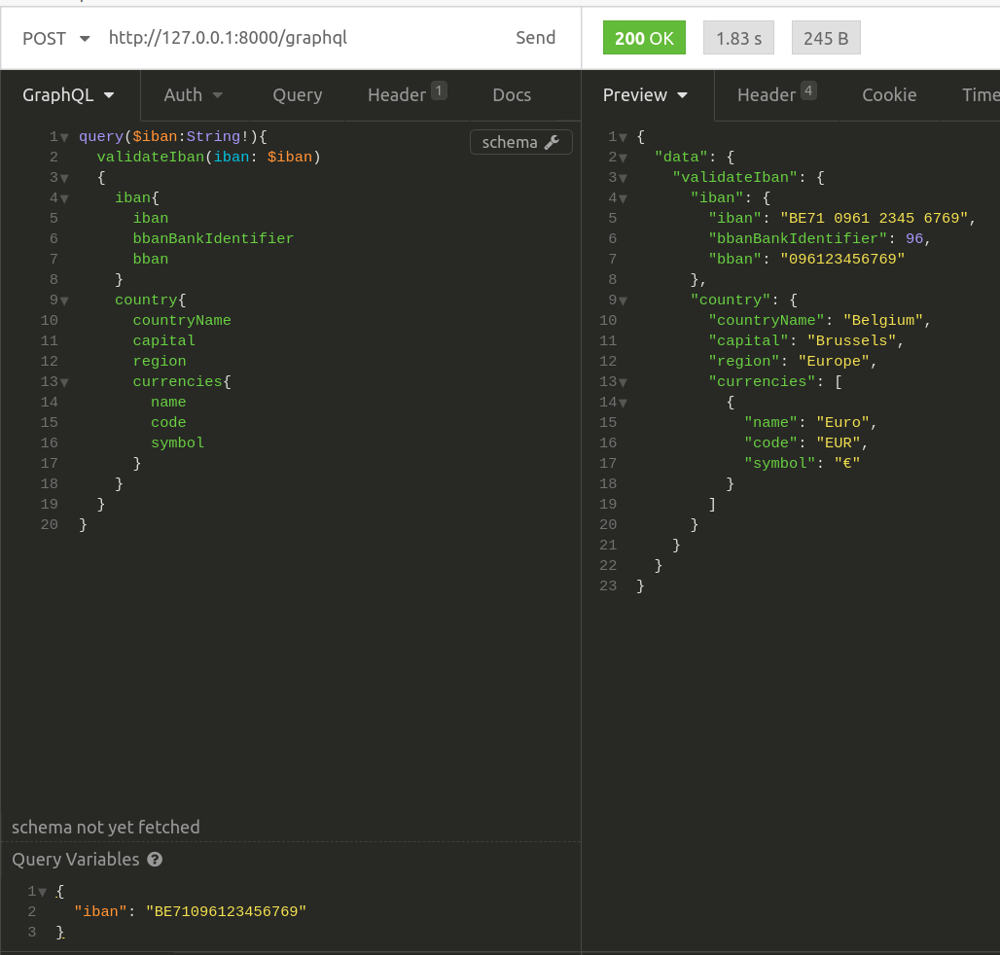
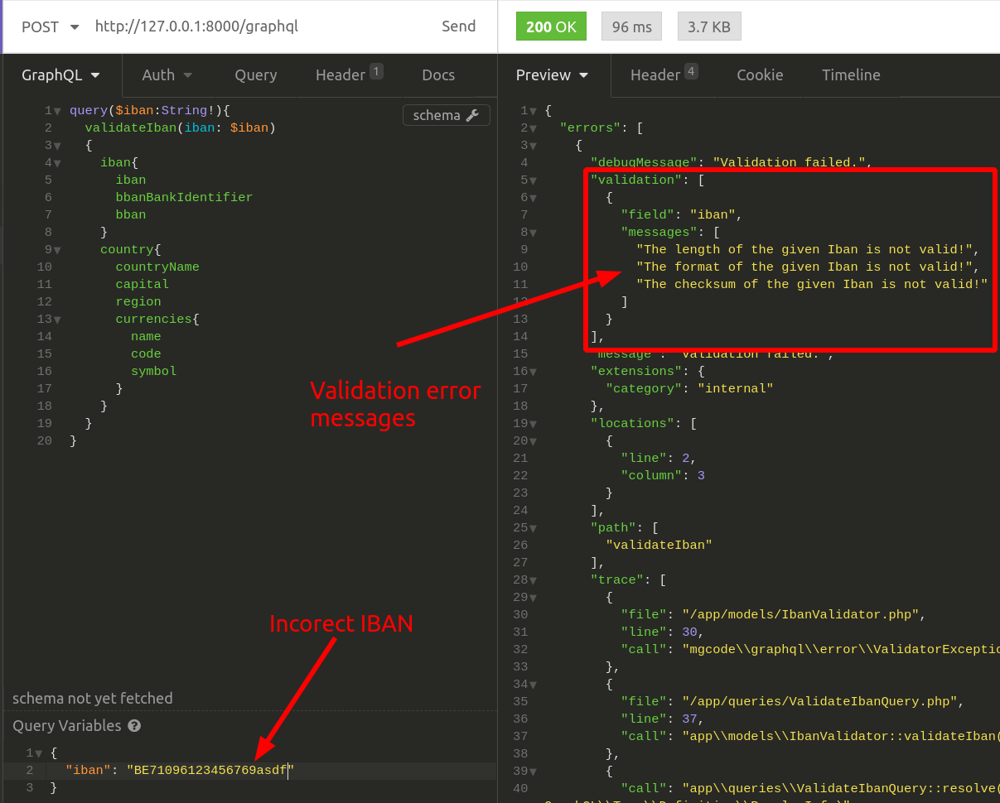
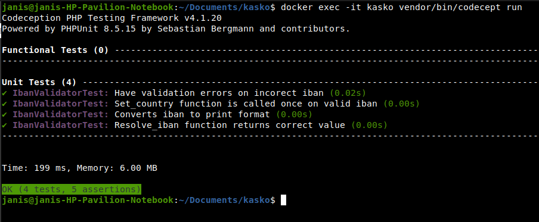
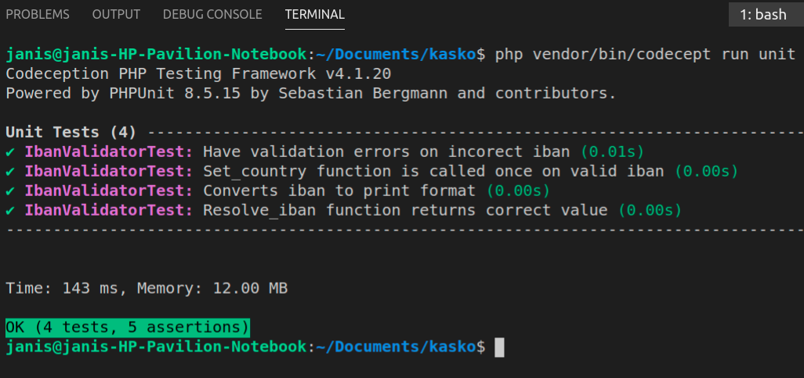

    
    <h1 align="center">IBAN validation task</h1>
     

Iban validator is graphql API, which is built using the Yii2 framework. You can pass the IBAN code as an input, which gets validated. If validation fails, you get a response with error details (e.g "The length of the given Iban is not valid!"). If validation success response holds IBAN details and information about the country associated with it.

It is built using Docker, which makes it very easy to run application on any enviroument.

Get Docker and docker-compose  [here](https://www.docker.com/products/container-runtime). Start the application with a single command on any os - no need for setup (Except Docker itself, of course).

Recomneded tool to make graphql queries is Insomina, which can be downloaded here [Insomnia](https://insomnia.rest/).
 
Follow these steps: 

    1. Clone project to your local enviroument.
    2. Open command terminal within Kasko folder where docker-compose.yml file is located.
    3. Execute these docer commands:
            * docker-compose run --rm php composer update --prefer-dist
            * docker-compose run --rm php composer install
            * docker-compose up -d
    4. Open insomnia and enter address http://127.0.0.1:8000/graphql
    5. Write query as in example picture. Supply IBAN number for "iban" variable.

Testing:

    Test can be executed within Docer container by calling command 
        1. docker exec -it kasko vendor/bin/codecept run"
    or within Kasko folder call command
        2. php vendor/bin/codecept run unit

Sample images

Validation success response.

Validation failed response.

Testing within Docker container.

Testing outside Docker container.

